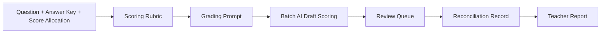

# 面向教师的人工智能主观题阅卷工作流技能

让人工智能承担主观题阅卷里的重复性判分劳动，让教师把精力放在评分标准、边界卷、争议卷和最终把关上。

```text
题目 + 参考答案
-> 教师与人工智能共建评分标准
-> 阅卷提示词
-> 人工智能批量草评分
-> 低置信度复核
-> 提交状态对账
-> 教师阅卷报告
```

## 三十秒理解

| 项目 | 说明 |
| --- | --- |
| 面向谁 | 一线教师、教研团队、智能体开发者、教育产品团队 |
| 输入 | 题目、参考答案、分值、小问拆分、学生答案文本或图片、评分要求 |
| 输出 | 评分参考标准、阅卷提示词、结构化草评分、复核列表、教师阅卷报告 |
| 核心价值 | 减少重复判分劳动，提升评分一致性，保留评分依据，支持复核和对账 |
| 使用边界 | 不做无评分标准的黑箱判分，不绕过验证码或权限限制，不提交真实学生隐私数据 |


## 先看示例

不安装也能看懂这个项目。示例使用一题虚构的高中物理主观题，不包含真实学生数据、真实答题图片、浏览器会话、密钥或平台对账记录。

- 示例导览：[`examples/physics-subjective-question/README.md`](examples/physics-subjective-question/README.md)
- 题目：[`question.md`](examples/physics-subjective-question/question.md)
- 评分标准：[`generated-rubric.md`](examples/physics-subjective-question/generated-rubric.md)
- 阅卷提示词：[`model-grading-prompt.md`](examples/physics-subjective-question/model-grading-prompt.md)
- 结构化草评分：[`sample-grading-output.json`](examples/physics-subjective-question/sample-grading-output.json)
- 教师报告：[`teacher-report.md`](examples/physics-subjective-question/teacher-report.md)

示例中的一份部分得分卷会被整理成这样的结果：

| 字段 | 示例 |
| --- | --- |
| 答卷编号 | `paper-phy-002` |
| 草稿分数 | `6 / 12` |
| 主要问题 | 千伏单位换算错误，后续计算连带错误 |
| 复核建议 | 可抽查连带错误处理是否合理 |

教师报告会进一步整理本题难点、共性错误、高分卷特征、零分卷分析和教学建议。

## 为什么值得收藏

- 你想让人工智能承担大量重复性主观题判分劳动。
- 你需要一套评分标准、草评分、复核、对账、报告的可复用模板。
- 你在做教育智能体或教育产品，需要一个真实工作流样例。
- 你希望支持网页登录阅卷平台，但不想把项目锁死在单一平台。

## 快速开始

### 方式一：不安装，先看示例

打开 [`examples/physics-subjective-question/README.md`](examples/physics-subjective-question/README.md)，按顺序查看题目、参考答案、评分标准、提示词、样例答卷、草评分、复核列表和教师报告。

### 方式二：安装为智能体技能

如果你的智能体支持 `SKILL.md`，可以把仓库克隆到技能目录。

Windows 上安装到 Codex：

```powershell
git clone https://github.com/zonywei/Yuejuan-marking-workflow-skill.git $env:USERPROFILE\.codex\skills\zhixue-marking-workflow
```

Windows 上安装到 Claude Code：

```powershell
git clone https://github.com/zonywei/Yuejuan-marking-workflow-skill.git $env:USERPROFILE\.claude\skills\zhixue-marking-workflow
```

macOS 或 Linux：

```bash
git clone https://github.com/zonywei/Yuejuan-marking-workflow-skill.git ~/.codex/skills/zhixue-marking-workflow
git clone https://github.com/zonywei/Yuejuan-marking-workflow-skill.git ~/.claude/skills/zhixue-marking-workflow
```

调用示例：

```text
Use $zhixue-marking-workflow 帮我根据 examples/physics-subjective-question 里的题目、答案和样例答卷，整理评分标准、阅卷提示词、复核列表和教师报告。
```

本仓库不是一键通用阅卷平台。真实阅卷前，请替换为教师确认过的题目、答案和评分要求，并把所有学生数据保存在仓库外。

## 核心能力

- 评分标准整理：从题目、参考答案、分值拆出评分点和等价表达。
- 阅卷提示词生成：把评分标准转成可复用的模型阅卷提示词。
- 人工智能批量草评分：输出每小问得分、总分、理由、置信度和复核标记。
- 复核队列：把低置信度、边界卷、疑似空白卷和争议卷分离出来。
- 对账恢复：用本地记录、事件日志和平台状态确认阅卷进度。
- 教师报告：从评分证据生成阅卷概况、共性错误、高分特征和教学建议。

## 适用场景

- 教师希望让人工智能处理重复判分，但保留评分标准确认权。
- 教研组希望统一主观题评分标准，并复盘共性错误。
- 教育产品团队希望把网页登录阅卷平台拆成可审计工作流。
- 智能体开发者希望参考一个教育场景下的 `SKILL.md` 设计。

## 平台适配

项目保留了一个智学网适配脚本：[`scripts/zhixue_mark.py`](scripts/zhixue_mark.py)。它只应在教师已授权的当前阅卷任务中使用，写回平台或修改分数前必须获得明确确认。

对于其他网页登录阅卷平台，建议只复用评分、复核、对账和报告流程；平台登录、取卷、提交和重评逻辑应作为独立适配器处理。

适配新平台时应遵守：

1. 只在教师已登录且有权限的任务内操作。
2. 不绕过验证码、短信、扫码、人机验证或权限限制。
3. 先验证只读流程，再考虑提交流程。
4. 提交前明确确认，提交后立即对账。
5. 不把浏览器会话、密钥、真实学生数据或答题图片提交到仓库。

## 安全与隐私

详见 [`docs/safety-and-privacy.md`](docs/safety-and-privacy.md)。

不要提交到仓库：

- 浏览器会话、密钥、令牌或本地配置。
- 真实学生编号、姓名、班级或答题图片。
- 含学生数据的阅卷记录、事件日志或报告。
- `zhixue_work/` 等临时输出目录。

示例必须使用虚构或脱敏数据。

## 目录结构

```text
.
├── SKILL.md
├── agents/
│   └── openai.yaml
├── docs/
│   ├── positioning.md
│   ├── publish-checklist.md
│   └── safety-and-privacy.md
├── examples/
│   └── physics-subjective-question/
├── references/
│   ├── grading-strategy.md
│   ├── model-scoring.md
│   ├── prompt-generation.md
│   ├── speed-accuracy-controls.md
│   └── subject-scoring-defaults.md
├── scripts/
│   ├── build_prompt_pack.py
│   ├── prompt_pack.example.json
│   ├── zhixue_mark.config.example.json
│   └── zhixue_mark.py
└── requirements.txt
```

## 校验

```powershell
py -3 "$env:USERPROFILE\.codex\skills\.system\skill-creator\scripts\quick_validate.py" .
py -3 -B -m py_compile .\scripts\build_prompt_pack.py .\scripts\zhixue_mark.py
```

## 许可证

本项目使用 `MIT` 许可证。你可以使用、修改、分发和商业使用本项目，但需要保留版权声明和许可证文本。

---

# AI Subjective Question Marking Workflow for Teachers

Let AI handle repetitive subjective-question draft scoring, while teachers focus on rubrics, borderline papers, disputed cases, and final control.

```text
Question + Answer Key
-> Teacher-AI Scoring Rubric
-> Grading Prompt
-> Batch AI Draft Scoring
-> Review Queue
-> Reconciliation
-> Teacher Report
```

## 30-Second Version

| Item | Meaning |
| --- | --- |
| Who it is for | Teachers, teaching teams, agent developers, education product teams |
| Input | Question, answer key, score allocation, student answer text or images, grading rules |
| Output | Scoring rubric, grading prompt, structured draft scores, review queue, teacher report |
| Value | Less repetitive grading work, more consistent scoring, preserved evidence, reviewable edge cases |
| Boundaries | No rubric-free black-box scoring, no CAPTCHA or permission bypass, no real student data in the repo |



## See The Demo First

No install is needed to understand the project. The demo uses a fictional high-school physics problem and contains no real student data, answer images, browser sessions, secrets, or platform ledger.

- Demo tour: [`examples/physics-subjective-question/README.md`](examples/physics-subjective-question/README.md)
- Question: [`question.md`](examples/physics-subjective-question/question.md)
- Rubric: [`generated-rubric.md`](examples/physics-subjective-question/generated-rubric.md)
- Grading prompt: [`model-grading-prompt.md`](examples/physics-subjective-question/model-grading-prompt.md)
- Structured draft scoring: [`sample-grading-output.json`](examples/physics-subjective-question/sample-grading-output.json)
- Teacher report: [`teacher-report.md`](examples/physics-subjective-question/teacher-report.md)

One partial-credit paper in the demo is summarized like this:

| Field | Example |
| --- | --- |
| Paper ID | `paper-phy-002` |
| Draft score | `6 / 12` |
| Main issue | Kilovolt conversion error with carried-forward calculation error |
| Review suggestion | Spot-check carried-forward error handling |

The teacher report then summarizes key difficulty points, common errors, high-score patterns, zero-score analysis, and teaching suggestions.

## Why Star This Repo?

- You want AI to handle repetitive subjective-question scoring work.
- You need a reusable template for rubric, draft scoring, review, reconciliation, and reporting.
- You are building an education agent or education product and need a real workflow example.
- You want web grading platform support without locking the project to one platform.

## Quickstart

### Option A: Read The Demo Without Installing

Open [`examples/physics-subjective-question/README.md`](examples/physics-subjective-question/README.md) and follow the files in order: question, answer key, rubric, prompt, sample answers, draft scores, review queue, and teacher report.

### Option B: Install As A Skill

If your agent supports `SKILL.md`, clone this repository into its skill directory.

Codex on Windows:

```powershell
git clone https://github.com/zonywei/Yuejuan-marking-workflow-skill.git $env:USERPROFILE\.codex\skills\zhixue-marking-workflow
```

Claude Code on Windows:

```powershell
git clone https://github.com/zonywei/Yuejuan-marking-workflow-skill.git $env:USERPROFILE\.claude\skills\zhixue-marking-workflow
```

macOS or Linux:

```bash
git clone https://github.com/zonywei/Yuejuan-marking-workflow-skill.git ~/.codex/skills/zhixue-marking-workflow
git clone https://github.com/zonywei/Yuejuan-marking-workflow-skill.git ~/.claude/skills/zhixue-marking-workflow
```

Example invocation:

```text
Use $zhixue-marking-workflow with examples/physics-subjective-question. Prepare the rubric, grading prompt, review queue, and teacher report.
```

This repository is not a one-click universal grading platform. For real grading, replace the demo with teacher-approved materials and keep all student data outside the repository.

## Core Capabilities

- Rubric preparation: turn a question, answer key, and score allocation into scoring atoms and accepted equivalents.
- Grading prompt generation: convert the rubric into reusable model-grading prompts.
- Batch AI draft scoring: output part scores, total score, reasons, confidence, and review flags.
- Review queue: separate low-confidence, borderline, suspected blank, and disputed papers.
- Reconciliation and recovery: compare local records, event logs, and platform state.
- Teacher reports: generate score overview, common errors, strong response patterns, and teaching suggestions from evidence.

## Good Fits

- Teachers who want AI to handle repetitive scoring while keeping rubric control.
- Teaching teams that want shared subjective-question scoring standards.
- Education product teams modeling web marking systems as auditable workflows.
- Agent developers looking for a practical `SKILL.md` example in education.

## Platform Adaptation

The repository includes a Zhixue adapter script: [`scripts/zhixue_mark.py`](scripts/zhixue_mark.py). It should only be used inside an authorized teacher task, and platform write-back or score correction actions require explicit confirmation.

For other web grading platforms, reuse the scoring, review, reconciliation, and reporting workflow. Keep login, paper fetching, submission, and regrade logic in a separate platform adapter.

When adapting a new platform:

1. Operate only inside a teacher-authorized task.
2. Do not bypass CAPTCHA, SMS, QR confirmation, human verification, or permission checks.
3. Validate read-only flows before submit flows.
4. Confirm before submission and reconcile immediately after.
5. Never commit browser sessions, secrets, real student data, or answer images.

## Safety And Privacy

See [`docs/safety-and-privacy.md`](docs/safety-and-privacy.md).

Never commit:

- browser sessions, secrets, tokens, or local config
- real student identifiers, names, classes, or answer images
- grading records, event logs, or reports containing student data
- temporary output folders such as `zhixue_work/`

Examples must use fictional or anonymized data.

## Repository Layout

```text
.
├── SKILL.md
├── agents/
│   └── openai.yaml
├── docs/
│   ├── positioning.md
│   ├── publish-checklist.md
│   └── safety-and-privacy.md
├── examples/
│   └── physics-subjective-question/
├── references/
│   ├── grading-strategy.md
│   ├── model-scoring.md
│   ├── prompt-generation.md
│   ├── speed-accuracy-controls.md
│   └── subject-scoring-defaults.md
├── scripts/
│   ├── build_prompt_pack.py
│   ├── prompt_pack.example.json
│   ├── zhixue_mark.config.example.json
│   └── zhixue_mark.py
└── requirements.txt
```

## Validation

```powershell
py -3 "$env:USERPROFILE\.codex\skills\.system\skill-creator\scripts\quick_validate.py" .
py -3 -B -m py_compile .\scripts\build_prompt_pack.py .\scripts\zhixue_mark.py
```

## License

This project is licensed under the MIT License. You may use, modify, distribute, and use it commercially, provided that the copyright notice and license text are preserved.
