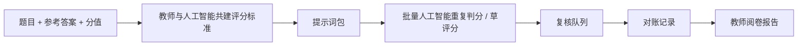
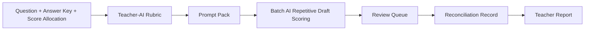

# 面向教师的人工智能主观题阅卷工作流技能

把主观题阅卷变成一个可控制的流程：

```text
题目 + 参考答案 -> 教师与人工智能共建评分标准 -> 提示词包 -> 人工智能重复性判分 / 草评分 -> 复核队列 -> 对账 -> 教师阅卷报告
```

> 本项目的目标是让人工智能承担大量重复性判分劳动，教师与人工智能一起明确评分参考标准，并把阅卷流程做得更稳定、可复核、可追踪。

## 三十秒理解

| 项目 | 说明 |
| --- | --- |
| 面向谁 | 一线教师、教研团队、智能体开发者、教育产品团队 |
| 输入 | 题目、参考答案、分值、小问拆分、学生答案文本或图片、评分要求 |
| 输出 | 评分参考标准、阅卷提示词、结构化草评分、低置信度复核列表、教师阅卷报告 |
| 价值 | 让人工智能承担重复性判分劳动，提高评分一致性，保留证据，暴露边界卷，支持提交后对账 |
| 不做什么 | 不做无评分标准的黑箱判分，不绕过验证码或权限限制，不保存真实学生隐私数据 |



## 先看示例

不安装也能看懂这个项目。先看虚构的高中物理主观题示例：

- 示例导览：[`examples/physics-subjective-question/README.md`](examples/physics-subjective-question/README.md)
- 题目：[`question.md`](examples/physics-subjective-question/question.md)
- 评分标准：[`generated-rubric.md`](examples/physics-subjective-question/generated-rubric.md)
- 模型阅卷提示词：[`model-grading-prompt.md`](examples/physics-subjective-question/model-grading-prompt.md)
- 结构化草评分：[`sample-grading-output.json`](examples/physics-subjective-question/sample-grading-output.json)
- 教师报告：[`teacher-report.md`](examples/physics-subjective-question/teacher-report.md)

示例是关于远距离输电的虚构高中物理计算题，不包含真实学生数据、真实答题图片、浏览器会话、密钥或平台对账记录。

## 输出长什么样

示例中的一份部分得分卷会被整理成这样的结构化结果：

| 字段 | 示例 |
| --- | --- |
| 答卷编号 | `paper-phy-002` |
| 草稿分数 | `6 / 12` |
| 主要问题 | 千伏单位换算错误，后续计算连带错误 |
| 是否进入复核 | 不强制复核，可抽样检查 |

教师报告会进一步整理：

- 阅卷概况
- 本题难点
- 共性错误
- 高分卷特征
- 零分卷和低置信度卷分析
- 教学建议
- 阅卷建议

## 为什么值得收藏

- 你是教师，想让人工智能承担重复性主观题判分劳动。
- 你在做智能体技能，需要一个真实教育工作流样例。
- 你在评估人工智能判分，但不想做无标准、不可复核的黑箱判分。
- 你需要一套评分标准、证据、复核队列、对账、报告的模板。
- 你需要智学网优先的适配器，但又不想把项目锁死在单一平台。

## 为什么不能只让人工智能裸打分

直接把学生答案丢给模型并要求“给个分”很危险。它可能在不同答卷之间标准不一致，可能漏掉隐藏评分规则，可能过度相信不清晰的手写内容，也可能给出后续无法复核的分数。

本项目不是回避人工智能判分，而是把人工智能判分放进可控流程里：

- 教师与人工智能共同整理评分参考标准，教师确认后再批量使用。
- 每个分数都要有理由和证据。
- 低置信度、边界卷、疑似空白卷进入复核队列。
- 本地记录和平台提交状态要对账。
- 真实提交或重提分数前需要教师确认。

目标是减少教师重复判分劳动，让人工智能负责大批量草评分，让教师把精力放在评分标准、边界卷、争议卷和最终把关上。

## 快速开始

### 方式一：不安装，先看示例

打开 [`examples/physics-subjective-question/README.md`](examples/physics-subjective-question/README.md)，按顺序查看题目、参考答案、评分标准、模型提示词、样例答卷、草评分、复核队列和教师报告。

### 方式二：安装为智能体技能

把仓库克隆到你的智能体技能目录。

在 Windows 上安装到 Codex：

```powershell
git clone https://github.com/zonywei/Yuejuan-marking-workflow-skill.git $env:USERPROFILE\.codex\skills\zhixue-marking-workflow
```

在 Windows 上安装到 Claude Code：

```powershell
git clone https://github.com/zonywei/Yuejuan-marking-workflow-skill.git $env:USERPROFILE\.claude\skills\zhixue-marking-workflow
```

在 macOS 或 Linux 上安装：

```bash
git clone https://github.com/zonywei/Yuejuan-marking-workflow-skill.git ~/.codex/skills/zhixue-marking-workflow
git clone https://github.com/zonywei/Yuejuan-marking-workflow-skill.git ~/.claude/skills/zhixue-marking-workflow
```

在支持技能调用的智能体里使用：

```text
Use $zhixue-marking-workflow 帮我根据 examples/physics-subjective-question 里的题目、答案和样例学生答案，整理评分标准、模型阅卷提示词、复核队列和教师报告。
```

本仓库包含辅助脚本，但不宣称能一键适配所有阅卷平台。真实阅卷前，请替换为教师确认过的题目、答案和评分要求，并把所有学生数据保存在仓库外。

## 安装方式

上面的快速开始已经给出常见安装命令。对于其他支持 `SKILL.md` 的智能体，可以把整个仓库作为一个技能目录安装，并保持这些路径在同一目录内：

- `SKILL.md`
- `references/`
- `scripts/`
- `agents/`
- `examples/`

## 面向用户

完整定位见 [`docs/positioning.md`](docs/positioning.md)。

- 一线教师：需要批改大量主观题，希望把重复性判分交给人工智能，同时保留评分标准确认和复核权。
- 教研组长或备课组：希望统一评分标准，复盘共性错误，产出教学反馈。
- 智能体开发者：希望参考一个教育场景下的技能工作流设计。
- 教育产品或学校技术团队：希望把网页登录阅卷平台拆成可审计的模块：登录会话、缓存、评分、提交、复核、对账、报告。

## 项目介绍

这是一个面向教师、教研团队、学校和教育公司的通用智能体阅卷工作流技能，用于让人工智能承担重复性主观题判分劳动，同时支持评分标准整理、批量评分、复核对账和教师报告生成。

当前技能名称为 `$zhixue-marking-workflow`。名称保留了最早的智学网场景，便于已有智能体继续识别和调用；但项目定位已经扩展为通用网页登录阅卷平台工作流：智学网优先，同时可以迁移到其他需要登录、取卷、评分、提交、复核和对账的阅卷系统。

## 解决的问题

主观题阅卷真正困难的不只是“点提交”。更重要的是：

- 评分标准能不能稳定执行。
- 空白卷、边界卷、低置信度卷能不能识别。
- 批量处理后能不能回查每一份卷子的评分依据。
- 本地评分记录、提交事件和平台状态能不能对得上。
- 阅卷结束后能不能形成教师可直接阅读的教学反馈报告。

## 核心能力

- 评分标准整理：从题目、参考答案、分值拆出评分标准和得分点。
- 提示词包生成：生成评分标准提示词、原题讲解提示词和模型阅卷提示词草稿。
- 人工智能重复性判分：要求结构化输出每小问得分、总分、理由、置信度和复核标记。
- 批量阅卷：支持缓存、分批评分、置信度路由、抽样复核和低置信度队列。
- 平台适配：以智学网为主要适配器，同时给出迁移到其他网页登录阅卷平台的方法。
- 对账恢复：用本地记录、事件日志和平台复核列表确认阅卷是否真正完成。
- 教师报告：从保存证据生成阅卷概况、共性错误、高分特征、典型卷例和教学建议。

## 工作流

1. 定标：确认题目范围、总分、小问分值、评分原子、零分规则和等价答案。
2. 校准：先看少量样本，包括空白、低分、部分得分、高分和边界卷。
3. 稳定：把校准结果转成提示词规则、校验规则、复核标记和错误标签。
4. 批量：先缓存证据，再分批评分，并持续写入本地记录。
5. 复核：抽查高置信度草评分，重点复核低置信度和疑似零分卷。
6. 对账：比较本地记录、提交事件和平台状态。
7. 报告：用保存的证据生成教师能直接阅读的阅卷反馈。
8. 沉淀：把通用规则留在技能里，把本题专属细则留在本次阅卷目录。

## 已发布平台

- GitHub：`https://github.com/zonywei/Yuejuan-marking-workflow-skill`
- agentskill.sh：`https://agentskill.sh/zonywei/yuejuan-marking-workflow-skill`
- SkillHQ：`https://skillhq.dev/skills/user_0404bb5c/zhixue-marking-workflow`

## 商店信息

推荐标题：

```text
Yuejuan Marking Workflow Skill
```

一句话介绍：

```text
面向教师和教育机构的通用主观题阅卷工作流：教师与人工智能共建评分标准，由人工智能承担重复性草评分，并支持复核对账和教学反馈报告。
```

推荐分类：

```text
Education, Productivity, AI Agents
```

关键词：

```text
teacher, education, grading, marking, rubric, subjective questions, AI grading, draft scoring, web grading platform, Zhixue, reconciliation, teacher reports
```

## 典型使用场景

- 教师上传题目、参考答案和分值，智能体帮助生成评分标准草稿。
- 教师登录阅卷平台后，智能体协助观察当前平台的可操作工作流。
- 批量缓存学生答题图片，按评分标准进行人工智能重复性草评分。
- 将低置信度、边界卷、疑似空白卷放入复核队列。
- 对已提交或重提的分数与平台复核列表做对账。
- 生成面向教师的阅卷报告和教学反馈。

## 智学网适配器

`scripts/zhixue_mark.py` 是智学网专用辅助脚本，用于已授权教师会话下的获取、缓存、提交和重提流程。

先从示例配置复制本地配置文件：

```text
scripts/zhixue_mark.config.example.json
```

安装脚本依赖：

```powershell
py -3 -m pip install -r requirements.txt
```

常用命令：

```powershell
py -3 .\scripts\zhixue_mark.py calibrate-blanks .\confirmed-blank-papers
py -3 .\scripts\zhixue_mark.py current
py -3 .\scripts\zhixue_mark.py commit SCORE
py -3 .\scripts\zhixue_mark.py recommit-user USER_CODE SCORE
py -3 .\scripts\zhixue_mark.py recommit ITEM_ID SCORE USER_CODE
py -3 .\scripts\zhixue_mark.py batch-zero COUNT
py -3 .\scripts\zhixue_mark.py status
```

只有在教师确认当前任务允许提交、重提或临时占卷时，才使用提交类命令。

## 提示词包生成

当评分标准或模型阅卷提示词还不稳定时，使用：

```powershell
py -3 .\scripts\build_prompt_pack.py .\scripts\prompt_pack.example.json .\prompt-pack-out
```

会生成：

- `rubric-generation-prompt.md`
- `original-question-prompt.md`
- `standard-model-grading-prompt.md`
- `review-required.md`
- `source_bundle.md`
- `normalized_input.json`

真实阅卷前，教师需要审阅并确认生成的评分提示词。

## 跨平台迁移

对于非智学网平台，保留阅卷策略，只替换平台适配器。

迁移时按这个顺序观察：

1. 观察一次人工阅卷流程：打开试卷、看答案、输入分数、提交、进入下一份。
2. 只在教师已登录且授权的当前阅卷任务里检查网络请求。
3. 找出任务信息、试卷获取、图片获取、提交、复核列表和重评路径。
4. 先测试只读接口，再测试提交接口。
5. 先缓存一份试卷，并和浏览器界面比对。
6. 提交前获得明确授权，提交后立即对账。

不要自动绕过验证码、短信、扫码、人机验证、任务冲突或阅卷权属冲突。

## 安全与隐私

详见 [`docs/safety-and-privacy.md`](docs/safety-and-privacy.md)。

不要提交到仓库：

- 浏览器会话或密钥。
- 本地 `zhixue_mark.config.json`。
- 真实学生编号、姓名或答题图片。
- 含学生数据的阅卷记录、事件日志或报告。
- `zhixue_work/` 等临时输出目录。

`.gitignore` 已排除常见本地配置和缓存路径，但每次提交前仍应检查 `git status`。

## 目录结构

```text
.
├── SKILL.md
├── agents/
│   └── openai.yaml
├── docs/
│   ├── positioning.md
│   ├── publish-checklist.md
│   └── safety-and-privacy.md
├── examples/
│   └── physics-subjective-question/
├── references/
│   ├── grading-strategy.md
│   ├── model-scoring.md
│   ├── prompt-generation.md
│   ├── speed-accuracy-controls.md
│   └── subject-scoring-defaults.md
├── scripts/
│   ├── build_prompt_pack.py
│   ├── prompt_pack.example.json
│   ├── zhixue_mark.config.example.json
│   └── zhixue_mark.py
└── requirements.txt
```

## 仓库主题建议

建议设置这些仓库主题：

```text
ai
education
teacher-tools
grading
marking
rubric
ai-agents
skill
subjective-questions
workflow
zhixue
teaching
```

## 校验

```powershell
py -3 "$env:USERPROFILE\.codex\skills\.system\skill-creator\scripts\quick_validate.py" .
py -3 -B -m py_compile .\scripts\build_prompt_pack.py .\scripts\zhixue_mark.py
```

## 许可证

本项目使用 `MIT` 许可证。你可以使用、修改、分发和商业使用本项目，但需要保留版权声明和许可证文本。

---

# AI Subjective Question Marking Workflow for Teachers

Turn subjective-question marking into a controlled workflow:

```text
Question + Answer Key -> Teacher-AI Rubric -> Prompt Pack -> AI Repetitive Draft Scoring -> Review Queue -> Reconciliation -> Teacher Report
```

> This project lets AI handle repetitive draft scoring while teachers co-define the rubric, review risky cases, and keep the workflow traceable.

## 30-Second Version

| Item | Meaning |
| --- | --- |
| Who it is for | Teachers, teaching teams, agent developers, education product teams |
| Input | Question, answer key, score allocation, student answer text or images, grading rules |
| Output | Scoring reference rubric, grading prompt, structured draft scores, review queue, teacher report |
| Value | AI handles repetitive scoring work, while evidence, review, and reconciliation remain visible |
| What it is not | Black-box scoring without a rubric, CAPTCHA bypass, permission bypass, or storage for real student data |



## See The Demo First

No install is needed to understand the project. Start with the fictional high-school physics example:

- Demo tour: [`examples/physics-subjective-question/README.md`](examples/physics-subjective-question/README.md)
- Question: [`question.md`](examples/physics-subjective-question/question.md)
- Rubric: [`generated-rubric.md`](examples/physics-subjective-question/generated-rubric.md)
- Model grading prompt: [`model-grading-prompt.md`](examples/physics-subjective-question/model-grading-prompt.md)
- Structured draft scoring: [`sample-grading-output.json`](examples/physics-subjective-question/sample-grading-output.json)
- Teacher report: [`teacher-report.md`](examples/physics-subjective-question/teacher-report.md)

The demo is a fictional long-distance power transmission problem. It contains no real student data, real answer images, browser sessions, secrets, or platform ledger.

## What The Output Looks Like

One partial-credit paper in the demo is summarized like this:

| Field | Example |
| --- | --- |
| Paper ID | `paper-phy-002` |
| Draft score | `6 / 12` |
| Main issue | Kilovolt conversion error with carried-forward calculation error |
| Review status | No forced review, but suitable for sampling |

The teacher-facing report further summarizes:

- score overview
- key difficulty points
- common errors
- high-score answer patterns
- zero-score and low-confidence analysis
- teaching suggestions
- marking suggestions

## Why Star This Repo?

- You are a teacher and want AI to take over repetitive subjective-question scoring work.
- You are building an agent skill and need a real education workflow example.
- You are evaluating AI scoring but do not want rubric-free, unauditable black-box grading.
- You need a template for rubric, evidence, review queue, reconciliation, and report generation.
- You want a Zhixue-first adapter without locking the whole project to one platform.

## Why Not Just Ask AI To Grade Without A Workflow?

Directly asking AI to "grade this answer" is risky. It can be inconsistent across papers, miss hidden score rules, over-trust unclear handwriting, or produce scores that cannot be audited later.

This project does not avoid AI scoring. It puts AI scoring inside a controlled workflow:

- Teachers and AI co-develop the scoring reference rubric, and the teacher confirms it before batch use.
- Every score should keep a reason and evidence.
- Low-confidence, borderline, and suspected blank papers go to a review queue.
- Local records and platform submission status must be reconciled.
- Real submissions or score corrections require teacher confirmation.

The goal is to reduce repetitive teacher scoring labor. AI handles large-volume draft scoring; teachers focus on rubric quality, borderline cases, disputed papers, and final control.

## Quickstart

### Option A: Read The Demo Without Installing

Open [`examples/physics-subjective-question/README.md`](examples/physics-subjective-question/README.md) and follow the files in order: question, answer key, rubric, model prompt, sample answers, draft scoring, review queue, and teacher report.

### Option B: Install As A Skill

Clone this repository into the skill directory used by your agent.

Codex on Windows:

```powershell
git clone https://github.com/zonywei/Yuejuan-marking-workflow-skill.git $env:USERPROFILE\.codex\skills\zhixue-marking-workflow
```

Claude Code on Windows:

```powershell
git clone https://github.com/zonywei/Yuejuan-marking-workflow-skill.git $env:USERPROFILE\.claude\skills\zhixue-marking-workflow
```

macOS or Linux:

```bash
git clone https://github.com/zonywei/Yuejuan-marking-workflow-skill.git ~/.codex/skills/zhixue-marking-workflow
git clone https://github.com/zonywei/Yuejuan-marking-workflow-skill.git ~/.claude/skills/zhixue-marking-workflow
```

Invoke the skill in a compatible agent:

```text
Use $zhixue-marking-workflow with examples/physics-subjective-question. Prepare the rubric, model grading prompt, review queue, and teacher report.
```

This repository includes helper scripts, but it does not claim to provide one-click automation for every grading platform. For real grading, replace the example with teacher-approved materials and keep all student data outside the repository.

## Install

The common install commands are shown in the Quickstart. For other agents that support `SKILL.md`, install the whole repository as one skill folder and keep these paths together:

- `SKILL.md`
- `references/`
- `scripts/`
- `agents/`
- `examples/`

## Intended Users

See [`docs/positioning.md`](docs/positioning.md) for the full positioning.

- Teachers who grade large volumes of subjective questions and want AI to handle repetitive scoring while preserving rubric confirmation and review.
- Teaching leads who need shared rubrics, common-error summaries, and teaching feedback.
- Agent developers who want a concrete skill workflow for an education scenario.
- Education product or school technical teams that want to model web marking platforms as auditable modules: session, cache, scoring, submission, review, reconciliation, and report.

## Project Introduction

Yuejuan Marking Workflow Skill is a general agent skill for teachers, teaching teams, schools, and education companies. It lets AI handle repetitive subjective-question draft scoring while supporting rubric preparation, batch scoring, reconciliation, and teacher-facing report generation.

The current skill name is `$zhixue-marking-workflow`. The name is preserved for compatibility with existing agent installations, but the project is no longer limited to Zhixue. It is Zhixue-first and can be adapted to similar authenticated web grading platforms that require login, paper fetching, scoring, submission, review, and reconciliation.

## What It Helps With

The hard part of subjective-question grading is not just clicking Submit. The workflow focuses on:

- applying the rubric consistently
- identifying blank, borderline, and low-confidence papers
- preserving evidence for every score
- reconciling local records with platform submission status
- producing useful teaching feedback after grading

## Core Capabilities

- Rubric preparation: turn a question, answer key, and score allocation into scoring atoms.
- Prompt pack generation: create rubric, original-question, and model-grading prompt drafts.
- AI repetitive scoring: require structured part scores, total score, reasons, confidence, and review flags.
- Batch grading: cache papers, score in batches, route by confidence, audit samples, and review uncertain cases.
- Platform adaptation: use Zhixue as the first adapter and apply the same strategy to similar web grading systems.
- Reconciliation and recovery: compare local records, event logs, and platform status before claiming completion.
- Teacher-facing reports: summarize completion, common mistakes, strong responses, examples, and teaching suggestions.

## Workflow

1. Define the task, score ceiling, scoring atoms, zero-credit rules, and acceptable equivalents.
2. Calibrate on a small sample: blank, low, partial, high, and borderline papers.
3. Stabilize prompts, validation checks, review flags, and error tags.
4. Batch only after caching evidence and writing structured local records.
5. Audit high-confidence draft scores and review uncertain or suspicious cases.
6. Reconcile local records, submit events, and platform status.
7. Generate reports from saved evidence.
8. Keep reusable rules in the skill and task-specific rules in the run folder.

## Published Listings

- GitHub: `https://github.com/zonywei/Yuejuan-marking-workflow-skill`
- agentskill.sh: `https://agentskill.sh/zonywei/yuejuan-marking-workflow-skill`
- SkillHQ: `https://skillhq.dev/skills/user_0404bb5c/zhixue-marking-workflow`

## Marketplace Listing

Recommended title:

```text
Yuejuan Marking Workflow Skill
```

Short description:

```text
A general subjective-question marking workflow for teachers and education teams: co-create rubrics with AI, let AI handle repetitive draft scoring, reconcile results, and generate teaching feedback reports.
```

Suggested category:

```text
Education, Productivity, AI Agents
```

Keywords:

```text
teacher, education, grading, marking, rubric, subjective questions, AI grading, draft scoring, web grading platform, Zhixue, reconciliation, teacher reports
```

## Typical Use Cases

- A teacher provides a question, answer key, and points; the agent drafts the rubric.
- After the teacher logs into a grading platform, the agent helps map the safe workflow.
- Student answer images are cached and graded against the rubric.
- Low-confidence, borderline, and suspected blank papers are routed to review.
- Submitted or recommitted scores are reconciled against platform state.
- A teacher-facing grading report is generated from saved evidence.

## Zhixue Adapter

`scripts/zhixue_mark.py` is a Zhixue-specific helper for fetch, cache, submit, and recommit flows under an authorized teacher session.

Start from the example config:

```text
scripts/zhixue_mark.config.example.json
```

Install script dependencies:

```powershell
py -3 -m pip install -r requirements.txt
```

Common commands:

```powershell
py -3 .\scripts\zhixue_mark.py calibrate-blanks .\confirmed-blank-papers
py -3 .\scripts\zhixue_mark.py current
py -3 .\scripts\zhixue_mark.py commit SCORE
py -3 .\scripts\zhixue_mark.py recommit-user USER_CODE SCORE
py -3 .\scripts\zhixue_mark.py recommit ITEM_ID SCORE USER_CODE
py -3 .\scripts\zhixue_mark.py batch-zero COUNT
py -3 .\scripts\zhixue_mark.py status
```

Use submit and recommit commands only when the teacher confirms that the current task allows the action.

## Prompt Pack Generation

Use this when the rubric or model-grading prompt is not ready:

```powershell
py -3 .\scripts\build_prompt_pack.py .\scripts\prompt_pack.example.json .\prompt-pack-out
```

It generates:

- `rubric-generation-prompt.md`
- `original-question-prompt.md`
- `standard-model-grading-prompt.md`
- `review-required.md`
- `source_bundle.md`
- `normalized_input.json`

The teacher should review and approve the generated grading prompt before real grading.

## Cross-Platform Adaptation

For non-Zhixue platforms, keep the grading strategy and replace only the platform adapter.

Adaptation checklist:

1. Observe one manual grading cycle.
2. Inspect network requests only inside the authorized teacher task.
3. Identify task metadata, paper fetch, image fetch, submit, review-list, and correction paths.
4. Test read-only calls before submit calls.
5. Cache one paper and compare it with the browser UI.
6. Get explicit approval before submission and reconcile immediately after.

Do not automate around CAPTCHA, SMS, QR confirmation, human verification, task mismatch, or reviewer ownership conflicts.

## Safety And Privacy

See [`docs/safety-and-privacy.md`](docs/safety-and-privacy.md).

Never commit:

- browser sessions or secrets
- local `zhixue_mark.config.json`
- real student identifiers, names, or answer images
- grading records, event logs, or reports containing student data
- temporary output folders such as `zhixue_work/`

The `.gitignore` excludes common local config and cache paths, but always inspect `git status` before committing.

## Repository Layout

```text
.
├── SKILL.md
├── agents/
│   └── openai.yaml
├── docs/
│   ├── positioning.md
│   ├── publish-checklist.md
│   └── safety-and-privacy.md
├── examples/
│   └── physics-subjective-question/
├── references/
│   ├── grading-strategy.md
│   ├── model-scoring.md
│   ├── prompt-generation.md
│   ├── speed-accuracy-controls.md
│   └── subject-scoring-defaults.md
├── scripts/
│   ├── build_prompt_pack.py
│   ├── prompt_pack.example.json
│   ├── zhixue_mark.config.example.json
│   └── zhixue_mark.py
└── requirements.txt
```

## GitHub Topics

Suggested repository topics:

```text
ai
education
teacher-tools
grading
marking
rubric
ai-agents
skill
subjective-questions
workflow
zhixue
teaching
```

## Validation

```powershell
py -3 "$env:USERPROFILE\.codex\skills\.system\skill-creator\scripts\quick_validate.py" .
py -3 -B -m py_compile .\scripts\build_prompt_pack.py .\scripts\zhixue_mark.py
```

## License

This project is licensed under the MIT License. You may use, modify, distribute, and use it commercially, provided that the copyright notice and license text are preserved.
