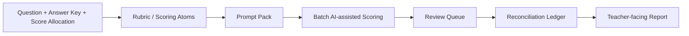

# AI Subjective Question Marking Workflow for Teachers

## Yuejuan Marking Workflow Skill / 面向教师的 AI 主观题阅卷工作流 Skill

Turn subjective-question marking into a controlled workflow:

```text
Question + Answer Key -> Rubric -> Prompt Pack -> AI-assisted Draft Scores -> Review Queue -> Reconciliation -> Teacher Report
```

> This project does not replace teacher judgment. It helps teachers build a repeatable, reviewable, and auditable grading workflow.
>
> 本项目不是让 AI 代替教师判分，而是帮助教师把阅卷流程做得更稳定、可复核、可追踪。

The installed skill name remains `$zhixue-marking-workflow` for compatibility, but the workflow is no longer limited to Zhixue. Zhixue is the first adapter; the reusable part is the marking workflow.

## 30-Second Version

| 项目 | What it means |
| --- | --- |
| Who it is for | Teachers, teaching teams, AI agent developers, education product teams |
| Input | Question, answer key, score allocation, student answer text/images, grading rules |
| Output | Rubric, grading prompt, structured draft scores, review queue, teacher report |
| Why it matters | More consistent scoring, visible evidence, reviewable edge cases, auditable submission flow |
| What it is not | Unattended auto-grading, CAPTCHA bypass, permission bypass, or a place to store real student data |



## See The Demo First

No install is needed to understand the project. Start here:

- Demo tour: [`examples/physics-subjective-question/README.md`](examples/physics-subjective-question/README.md)
- Question: [`question.md`](examples/physics-subjective-question/question.md)
- Rubric: [`generated-rubric.md`](examples/physics-subjective-question/generated-rubric.md)
- Model prompt: [`model-grading-prompt.md`](examples/physics-subjective-question/model-grading-prompt.md)
- Sample structured output: [`sample-grading-output.json`](examples/physics-subjective-question/sample-grading-output.json)
- Teacher report: [`teacher-report.md`](examples/physics-subjective-question/teacher-report.md)

The demo is a fictional high-school physics problem about long-distance power transmission. It contains no real student data, cookies, tokens, images, or platform ledger.

### Output Preview

```json
{
  "paper_id": "paper-phy-002",
  "total_score": 6,
  "max_score": 12,
  "common_error_tags": [
    "kv-conversion-error",
    "carried-forward-current-error"
  ],
  "review_required": false
}
```

Teacher-facing report output includes:

- score overview
- key difficulty points
- common errors
- high-score answer patterns
- zero-score / low-confidence analysis
- teaching suggestions
- marking suggestions

## Why Star This Repo?

Star it if you care about any of these:

- You are a teacher and want a safer way to use AI in subjective marking.
- You are building an AI agent skill and need a real education workflow example.
- You are evaluating AI-assisted grading but do not want black-box auto-scoring.
- You need a template for rubric, evidence, review queue, reconciliation, and report generation.
- You want a Zhixue-first adapter without locking the whole project to one platform.

## Why Not Just Ask AI To Grade?

Directly asking AI to "grade this answer" is risky. It can be inconsistent across papers, miss hidden score rules, over-trust unclear handwriting, or produce scores that cannot be audited later.

This project treats AI as an assistant inside a teacher-controlled workflow:

- The rubric is the scoring authority.
- Every score should keep a reason and evidence.
- Low-confidence or ambiguous papers go to a review queue.
- Platform submission and local records must be reconciled.
- A teacher should confirm scoring rules before real grading and confirm risky submissions before they are committed.

The goal is not unattended grading. The goal is a stable workflow that makes teacher review faster and safer.

## Quickstart / 快速使用

### Option A: Read The Demo Without Installing

Open [`examples/physics-subjective-question/README.md`](examples/physics-subjective-question/README.md) and follow the files in order.

### Option B: Install As A Skill

Clone this repository into the skill directory used by your agent.

Codex on Windows:

```powershell
git clone https://github.com/zonywei/Yuejuan-marking-workflow-skill.git $env:USERPROFILE\.codex\skills\zhixue-marking-workflow
```

Claude Code on Windows:

```powershell
git clone https://github.com/zonywei/Yuejuan-marking-workflow-skill.git $env:USERPROFILE\.claude\skills\zhixue-marking-workflow
```

macOS / Linux:

```bash
git clone https://github.com/zonywei/Yuejuan-marking-workflow-skill.git ~/.codex/skills/zhixue-marking-workflow
git clone https://github.com/zonywei/Yuejuan-marking-workflow-skill.git ~/.claude/skills/zhixue-marking-workflow
```

Then invoke the skill in a compatible agent:

```text
Use $zhixue-marking-workflow 帮我根据 examples/physics-subjective-question 里的题目、答案和样例学生答案，整理评分标准、模型阅卷 prompt、复核队列和教师报告。
```

Use the example files as input to your agent.

This repository includes helper scripts, but it does not pretend to provide a one-click grading system for every platform. For the demo, read the example files and ask your agent to produce or compare:

- `generated-rubric.md`
- `model-grading-prompt.md`
- `sample-grading-output.json`
- `review-queue.md`
- `teacher-report.md`

For real grading, replace the example with your own teacher-approved materials and keep all student data outside the repository.

## Install / 安装方式

The common install commands are shown in the Quickstart above. For other agents that support `SKILL.md`, install the whole repository as one skill folder and keep these paths together:

- `SKILL.md`
- `references/`
- `scripts/`
- `agents/`
- `examples/`

## Who This Is For

See [`docs/positioning.md`](docs/positioning.md) for the full positioning.

- 一线教师：需要批改大量主观题，希望减少重复劳动，但保留教师确认和复核权。
- AI Agent / Skill 开发者：希望参考一个教育场景下的 `SKILL.md` 工作流设计。
- 教育产品或学校技术团队：希望把网页登录阅卷平台拆成可审计的模块：登录会话、缓存、评分、提交、复核、对账、报告。

## 中文介绍

这是一个面向教师、教研团队、学校和教育公司的通用 Agent/智能体阅卷工作流 Skill，用于辅助主观题阅卷、评分标准整理、批量评分、复核对账和教师报告生成。

当前 Skill 名称为 `$zhixue-marking-workflow`。名称保留了最早的智学网场景，便于已有 Agent 继续识别和调用；但项目定位已经扩展为通用网页登录阅卷平台工作流：智学网优先，同时可以迁移到其他需要登录、取卷、评分、提交、复核和对账的阅卷系统。

## 面向用户

核心用户是教师，尤其是需要批改大量主观题的一线学科教师。

适合：

- 一线教师：希望提高阅卷效率，同时保持评分一致性和可复核性。
- 教研组长或备课组：希望统一评分标准、复盘共性错误、产出教学反馈。
- 学校或教育公司：希望把 AI 辅助阅卷接入现有网页阅卷平台，但需要安全、可审计的流程。
- 教育产品和技术团队：希望把网页登录阅卷平台拆成“登录会话、试卷缓存、评分、提交、复核、报告”等可复用模块。

## 解决的问题

主观题阅卷真正困难的不只是“点提交”。更重要的是：

- 评分标准能不能稳定执行。
- 空白卷、边界卷、低置信度卷能不能识别。
- 批量处理后能不能回查每一份卷子的评分依据。
- 本地评分记录、提交事件和平台状态能不能对得上。
- 阅卷结束后能不能形成教师可直接阅读的教学反馈报告。

## 核心能力

- 评分标准整理：从题目、参考答案、分值拆出 rubric 和评分原子。
- Prompt Pack 生成：生成 rubric prompt、原题讲解 prompt 和模型阅卷 prompt 草稿。
- AI 辅助评分：要求结构化输出每小问得分、总分、理由、置信度和复核标记。
- 批量阅卷：支持缓存、分批评分、置信度路由、抽样复核和低置信度队列。
- 平台适配：以智学网为主要 adapter，同时给出迁移到其他网页登录阅卷平台的方法。
- 对账恢复：用本地 ledger、event log 和平台复核列表确认阅卷是否真正完成。
- 教师报告：从保存证据生成阅卷概况、共性错误、高分特征、典型卷例和教学建议。

## 工作流

1. 定标：确认题目范围、总分、小问分值、评分原子、0 分规则和等价答案。
2. 校准：先看少量样本，包括空白、低分、部分得分、高分和边界卷。
3. 稳定：把校准结果转成 prompt 规则、校验规则、复核标记和错误标签。
4. 批量：先缓存证据，再分批评分，并持续写入本地 ledger。
5. 复核：抽查高置信度自动评分，重点复核低置信度和疑似 0 分卷。
6. 对账：比较本地 ledger、提交事件和平台状态。
7. 报告：用保存的证据生成教师能直接阅读的阅卷反馈。
8. 沉淀：把通用规则留在 Skill，把本题专属细则留在本次阅卷目录。

## English Introduction

Yuejuan Marking Workflow Skill is a general `SKILL.md` agent skill for teachers, teaching teams, schools, and education companies. It helps AI agents support subjective-question grading, rubric preparation, batch scoring, reconciliation, and teacher-facing report generation.

The current skill name is `$zhixue-marking-workflow`. The name is preserved for compatibility with existing agent installations, but the project is no longer limited to Zhixue. It is Zhixue-first and can be adapted to similar authenticated web grading platforms that require login, paper fetching, scoring, submission, review, and reconciliation.

## Intended Users

The primary users are teachers, especially subject teachers grading large volumes of subjective-answer papers.

Good fits:

- Teachers who want faster grading without losing consistency or accountability.
- Teaching leads who need shared rubrics, common-error summaries, and teaching feedback.
- Schools or education companies integrating AI-assisted grading into existing web marking systems.
- Education product or engineering teams modeling grading platforms as session, cache, scoring, submission, reconciliation, and reporting modules.

## What It Helps With

The hard part of subjective-question grading is not just clicking Submit. The workflow focuses on:

- applying the rubric consistently
- identifying blank, borderline, and low-confidence papers
- preserving evidence for every score
- reconciling local records with platform submission status
- producing useful teaching feedback after grading

## Core Capabilities

- Rubric preparation: turn a question, answer key, and score allocation into scoring atoms.
- Prompt pack generation: create rubric, original-question, and model-grading prompt drafts.
- AI-assisted scoring: require structured part scores, total score, reasons, confidence, and review flags.
- Batch grading: cache papers, score in batches, route by confidence, audit samples, and review uncertain cases.
- Platform adaptation: use Zhixue as the first adapter and apply the same strategy to similar web grading systems.
- Reconciliation and recovery: compare local ledgers, event logs, and platform status before claiming completion.
- Teacher-facing reports: summarize completion, common mistakes, strong responses, examples, and teaching suggestions.

## Workflow

1. Define the task, score ceiling, scoring atoms, zero-credit rules, and acceptable equivalents.
2. Calibrate on a small sample: blank, low, partial, high, and borderline papers.
3. Stabilize prompts, validation checks, review flags, and error tags.
4. Batch only after caching evidence and writing structured ledger rows.
5. Audit auto-scored papers and review uncertain or suspicious cases.
6. Reconcile local records, submit events, and platform status.
7. Generate reports from saved evidence.
8. Keep reusable rules in the skill and task-specific rules in the run folder.

## Published Listings / 已发布平台

- GitHub: `https://github.com/zonywei/Yuejuan-marking-workflow-skill`
- agentskill.sh: `https://agentskill.sh/zonywei/yuejuan-marking-workflow-skill`
- SkillHQ: `https://skillhq.dev/skills/user_0404bb5c/zhixue-marking-workflow`

## Marketplace Listing / 商店 Listing 信息

Recommended title:

```text
Yuejuan Marking Workflow Skill
```

Short description:

```text
面向教师和教育机构的通用主观题阅卷工作流：整理评分标准、辅助批量评分、复核对账，并生成教学反馈报告。
```

Suggested category:

```text
Education, Productivity, AI Agents
```

Keywords:

```text
teacher, education, grading, marking, rubric, subjective questions, AI-assisted grading, web grading platform, Zhixue, reconciliation, teacher reports
```

## Typical Use Cases

- A teacher provides a question, answer key, and points; the agent drafts the rubric.
- After the teacher logs into a grading platform, the agent helps map the safe workflow.
- Student answer images are cached and graded against the rubric.
- Low-confidence, borderline, and suspected blank papers are routed to review.
- Submitted or recommitted scores are reconciled against platform state.
- A teacher-facing grading report is generated from saved evidence.

## Zhixue Adapter / 智学网 Adapter

`scripts/zhixue_mark.py` is a Zhixue-specific helper for fetch/cache/submit/recommit flows under an authorized teacher session.

Start from the example config:

```text
scripts/zhixue_mark.config.example.json
```

Install script dependencies:

```powershell
py -3 -m pip install -r requirements.txt
```

Common commands:

```powershell
py -3 .\scripts\zhixue_mark.py calibrate-blanks .\confirmed-blank-papers
py -3 .\scripts\zhixue_mark.py current
py -3 .\scripts\zhixue_mark.py commit SCORE
py -3 .\scripts\zhixue_mark.py recommit-user USER_CODE SCORE
py -3 .\scripts\zhixue_mark.py recommit ITEM_ID SCORE USER_CODE
py -3 .\scripts\zhixue_mark.py batch-zero COUNT
py -3 .\scripts\zhixue_mark.py status
```

Use submit/recommit commands only when the teacher confirms that the current task allows the action.

## Prompt Pack Generation / Prompt Pack 生成

Use this when the rubric or model-grading prompt is not ready:

```powershell
py -3 .\scripts\build_prompt_pack.py .\scripts\prompt_pack.example.json .\prompt-pack-out
```

It generates:

- `rubric-generation-prompt.md`
- `original-question-prompt.md`
- `standard-model-grading-prompt.md`
- `review-required.md`
- `source_bundle.md`
- `normalized_input.json`

The teacher should review and approve the generated grading prompt before real grading.

## Cross-Platform Adaptation / 跨平台迁移

For non-Zhixue platforms, keep the grading strategy and replace only the platform adapter.

Adaptation checklist:

1. Observe one manual grading cycle.
2. Inspect network requests only inside the authorized teacher task.
3. Identify task metadata, paper fetch, image fetch, submit, review-list, and correction paths.
4. Test read-only calls before submit calls.
5. Cache one paper and compare it with the browser UI.
6. Get explicit approval before submission and reconcile immediately after.

Do not automate around CAPTCHA, SMS, QR confirmation, human verification, task mismatch, or reviewer ownership conflicts.

## Safety And Privacy / 安全与隐私

See [`docs/safety-and-privacy.md`](docs/safety-and-privacy.md).

Never commit:

- cookies or tokens
- local `zhixue_mark.config.json`
- real student identifiers, names, or answer images
- grading ledgers, event logs, or reports containing student data
- temporary output folders such as `zhixue_work/`

The `.gitignore` excludes common local config and cache paths, but always inspect `git status` before committing.

## Repository Layout / 目录结构

```text
.
├── SKILL.md
├── agents/
│   └── openai.yaml
├── docs/
│   ├── positioning.md
│   ├── publish-checklist.md
│   └── safety-and-privacy.md
├── examples/
│   └── physics-subjective-question/
├── references/
│   ├── grading-strategy.md
│   ├── model-scoring.md
│   ├── prompt-generation.md
│   ├── speed-accuracy-controls.md
│   └── subject-scoring-defaults.md
├── scripts/
│   ├── build_prompt_pack.py
│   ├── prompt_pack.example.json
│   ├── zhixue_mark.config.example.json
│   └── zhixue_mark.py
└── requirements.txt
```

## GitHub Topics / GitHub Topics 建议

Suggested repository topics:

```text
ai
education
teacher-tools
grading
marking
rubric
ai-agents
skill
subjective-questions
workflow
zhixue
teaching
```

## Validation / 校验

```powershell
py -3 "$env:USERPROFILE\.codex\skills\.system\skill-creator\scripts\quick_validate.py" .
py -3 -B -m py_compile .\scripts\build_prompt_pack.py .\scripts\zhixue_mark.py
```

## License / 许可证

This project is licensed under the MIT License. You may use, modify, distribute, and use it commercially, provided that the copyright notice and license text are preserved.
